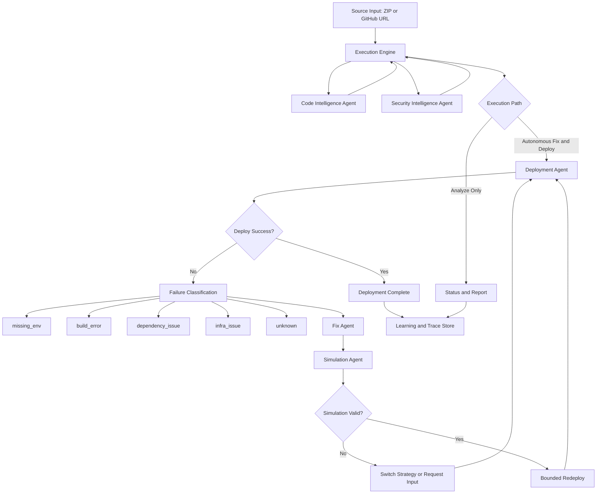
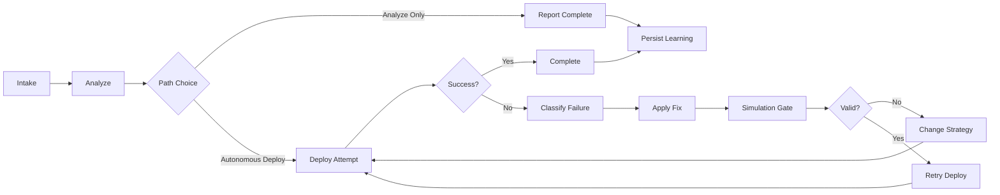

# Nestify - Architecture, Pipeline, and Feature Reference

Last updated: April 2026

Nestify is an autonomous, decision-driven DevSecOps platform that analyzes source code, reasons over risk and deployment constraints, applies bounded remediation, validates fixes, and executes cloud deployment with high-signal operator visibility.

This README is the primary current-state document for architecture, agent graph, pipeline, and feature coverage.

## 1) Product Definition

Nestify is an orchestration system, not a static deployment script.

Core behavior:

- ingest source code,
- build architecture and dependency understanding,
- enrich security and risk context,
- choose actions from runtime state,
- apply controlled fixes,
- validate through simulation,
- deploy with bounded adaptive retries,
- persist outcomes for explainability and learning.

## 2) Core Design Principles

- Decision over linear sequencing: next action is selected from current state.
- Safety over speed: simulation gate protects redeploy actions.
- Signal over noise: UI prioritizes decision, action, outcome.
- Bounded autonomy: retry caps and anti-repeat logic prevent loops.
- Explainability by default: decision and execution traces are persisted.

## 3) Current System Architecture

### 3.1 Frontend

- Stack: React, Vite, TypeScript, Framer Motion.
- Primary pages:
  - Upload
  - Analysis
  - Deployment
- Realtime model:
  - WebSocket execution events
  - polling fallback for status/report consistency
- UX model:
  - compressed execution feed,
  - summary-first deployment experience,
  - explicit fallback messaging.

### 3.2 Backend

- Stack: FastAPI.
- Orchestration core: app/core/execution_engine.py.
- API grouping: project-centric routes under /api/v1/projects/*.
- Persistence: SQLite default for project, remediation, and deployment records.

### 3.3 Intelligence and Agent Layer

Core actors:

- Meta-Agent / Orchestrator
- Code Intelligence Agent
- Security Intelligence Agent
- Fix Agent
- Simulation Agent
- Deployment Agent
- Knowledge Curation and Learning Layer

## 4) Agent Architecture (Current)

### Agent Roles

1. Meta-Agent / Orchestrator
- Selects next action from runtime state.
- Classifies failure categories.
- Enforces bounded retries and anti-repeat behavior.

2. Code Intelligence Agent
- Detects framework/runtime patterns.
- Builds architecture understanding for downstream decisions.

3. Security Intelligence Agent
- Enriches findings with practical risk context.
- Supports remediation prioritization.

4. Fix Agent
- Applies targeted conservative remediations.
- Records fix attempts and outcomes.

5. Simulation Agent
- Validates fixes before deploy retries.
- Prevents blind redeploy loops.

6. Deployment Agent
- Executes provider deployment workflows.
- Emits actionable failure metadata.

7. Knowledge Curation / Learning Layer
- Persists outcomes and traces.
- Supports improved future recommendations and routing.

## 5) Agent Graph

## 6) Execution Pipeline

### 6.1 Analyze Path

1. Intake source and initialize project state.
2. Run stack and architecture profiling.
3. Enrich security and risk findings.
4. Build deployment and cost reasoning context.
5. Publish status and report outputs.

Path constraint:

- Analyze path does not auto-deploy.

### 6.2 Autonomous Fix and Deploy Path

1. Start deployment attempt.
2. If failed, classify failure type.
3. Apply targeted remediation.
4. Run simulation validation gate.
5. If valid, retry deployment with bounded attempts.
6. If invalid or exhausted, switch strategy/provider or request user input.
7. Mark success or explicit fallback outcome.

## 7) Pipeline Graph

## 8) Runtime State Contract

Execution context tracks policy-critical fields:

- failures
- fixes_applied
- providers_tried
- provider_attempts
- last_failure_type
- simulation_validated
- decision_log

These fields drive anti-repeat policy, adaptive routing, and operator traceability.

## 9) Complete Feature Catalog

### 9.1 Source Intake Features

- ZIP upload workflow.
- GitHub repository URL intake workflow.
- Project state initialization and lifecycle status tracking.
- Temporary private GitHub publishing support for ZIP-only backend deployment scenarios.

### 9.2 Analysis and Intelligence Features

- Stack/runtime/framework detection.
- Architecture and dependency profiling.
- Security and risk enrichment.
- Deployment suitability reasoning.
- Cost and platform recommendation context generation.

### 9.3 Orchestration and Autonomy Features

- Decision-driven orchestration loop.
- Analyze-only and autonomous deploy path separation.
- Failure-class-based action routing.
- Bounded retries with provider caps.
- Duplicate-fix and repeat-strategy suppression.
- Strategy/provider switching on exhaustion conditions.
- User-input request paths for blockers that cannot be safely auto-resolved.

### 9.4 Remediation and Validation Features

- Controlled fix execution.
- Simulation-gated retry behavior.
- Retry deployment only after validation where applicable.
- Structured failure reason capture for debugging and learning.

### 9.5 Deployment Features

- Cloud-first deployment strategy.
- Provider-aware deployment logic.
- Explicit fallback semantics when cloud deployment cannot complete.
- Attempt-by-attempt deployment outcome tracking.
- Railway workspace-aware behavior through RAILWAY_WORKSPACE_ID when required.

### 9.6 Frontend and Operator Experience Features

- Upload, Analysis, and Deployment experience.
- Realtime execution stream over WebSocket.
- Polling fallback for snapshot consistency.
- Compressed high-signal feed:
  - decision/action/outcome emphasis,
  - duplicate event merge,
  - retry collapse,
  - reasoning-noise suppression.
- Summary-first deployment layout with practical controls.

### 9.7 Reporting and Audit Features

- Status reporting.
- Project report generation.
- Audit report endpoint.
- PDF export endpoint.

### 9.8 Learning and Historical Features

- Persistence of outcomes and execution traces.
- Reuse of historical data for future decision quality.
- Learning statistics support in API layer.

## 10) Feature Status Snapshot

### Implemented and Active

- Decision-driven orchestration core.
- Analyze/deploy path separation.
- Failure classification and adaptive routing.
- Bounded retries with anti-repeat safeguards.
- Simulation-gated remediation loop.
- Compressed deployment feed UX.
- Core project, report, and deploy API surface.

### Expanding

- Additional failure-class-specific remediation depth.
- Richer confidence outputs from simulation and policy reasoning.
- Wider scenario-based integration test coverage for routing behavior.

## 11) API Surface (High-Value)

- POST /api/v1/projects/upload
- POST /api/v1/projects/github
- GET /api/v1/projects/{project_id}/status
- GET /api/v1/projects/{project_id}/report
- GET /api/v1/projects/{project_id}/report/audit
- GET /api/v1/projects/{project_id}/report/pdf
- POST /api/v1/projects/{project_id}/autonomous-fix-deploy

## 12) Security and Repository Hygiene

- Do not commit .env files or secrets.
- Do not commit local database files or sidecar variants.
- Do not commit runtime snapshots or generated source dumps.
- Do not commit node_modules, dist, or virtual environment folders.
- Prefer private repository visibility for first publication.

## 13) Quick Start

### Backend

1. Create and activate a virtual environment.
2. Install dependencies from requirements.txt.
3. Run the FastAPI app from app.main.

### Frontend

1. Install frontend dependencies.
2. Run Vite development server.

## 14) Operational Checklist

- Frontend build succeeds.
- Backend syntax/compile checks succeed.
- Analyze and autonomous deploy flows are validated.
- Execution feed remains concise and high-signal.
- No secret or runtime artifacts are staged in git.

## 15) Related Documents

- Implementation detail reference: README_ARCHITECTURE.md
- Deployment and environment setup: DEPLOYMENT_GUIDE.md
