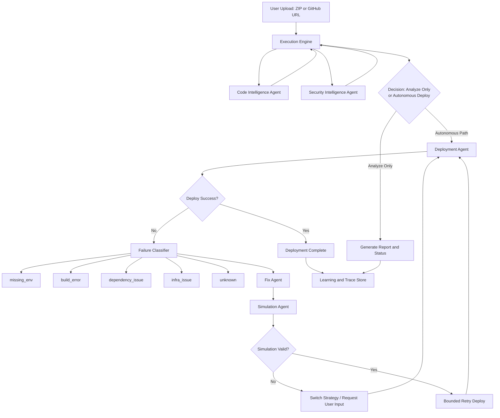
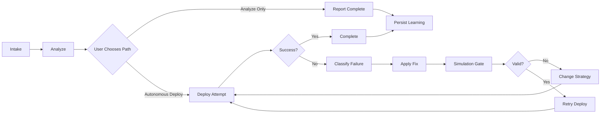

# Nestify - Autonomous Agentic DevSecOps Platform

Nestify is a decision-driven DevSecOps system that analyzes code, plans remediation, validates fixes, and executes cloud deployment with bounded autonomous retries.

This README reflects the current architecture and implementation as of April 2026.

## What Is Current Now

- Decision-driven orchestration in a central execution engine.
- Separate Analyze path and Autonomous Fix and Deploy path.
- Failure-class-based remediation and strategy switching.
- Simulation-gated retry before redeployment.
- Compressed high-signal live feed in Deployment UI.
- Explicit fallback reporting when cloud deployment cannot be completed.

## Core Features

- Source intake via ZIP or GitHub URL.
- Stack detection and architecture profiling.
- Security and risk enrichment.
- Remediation planning and controlled fix execution.
- Multi-provider deployment strategy (cloud-first).
- Bounded retries with anti-repeat logic.
- Learning and historical trace persistence.
- Audit-style reporting and PDF export.

## Current Agent Architecture

Nestify is organized as a coordinated agent system with a stateful meta-decision loop.

### Agent Roles

1. Meta-Agent / Orchestrator
- Selects next action from current state.
- Classifies failure type.
- Enforces bounded retries and anti-repeat behavior.

2. Code Intelligence Agent
- Detects app/runtime/framework patterns.
- Builds architecture-level understanding for downstream decisions.

3. Security Intelligence Agent
- Enriches vulnerabilities with practical risk context.
- Supports remediation prioritization.

4. Fix Agent
- Applies conservative, targeted remediation.
- Records fix attempts and outcomes.

5. Simulation Agent
- Validates that fixes are safe to retry in deployment.
- Prevents blind redeploy loops.

6. Deployment Agent
- Executes provider deployment actions.
- Returns actionable failure metadata.

7. Knowledge Curation / Learning Layer
- Stores outcomes and traces.
- Improves future routing and recommendations.

## Agent Architecture Graph

## Current Pipeline

### 1. Intake

- Accept ZIP upload or GitHub repository input.
- Build project context and initialize orchestration state.

### 2. Analyze Path

- Perform code profiling, security enrichment, and deployment reasoning.
- Produce status and report outputs.
- Analyze path does not auto-deploy.

### 3. Autonomous Fix and Deploy Path

- Attempt deployment.
- On failure, classify failure category.
- Apply targeted fix action.
- Run simulation validation gate.
- Retry deployment with bounded attempts.
- Switch provider/strategy when attempt cap or repeated failure condition is reached.

### 4. Outcome and Learning

- Persist actions, failures, provider attempts, and final outcomes.
- Expose concise, user-readable trace in UI/reporting.

## Pipeline Graph

## Runtime State Contract

Execution state tracks key fields used by policy and observability:

- failures
- fixes_applied
- providers_tried
- provider_attempts
- last_failure_type
- simulation_validated
- decision_log

## Backend and Frontend Architecture

### Backend

- Framework: FastAPI
- Orchestration core: app/core/execution_engine.py
- API routes: project upload/status/report/deploy workflows
- Persistence: SQLite by default for project and deployment records

### Frontend

- Stack: React + Vite + TypeScript + Framer Motion
- Primary views: Upload, Analysis, Deployment
- Realtime behavior:
  - WebSocket for live execution events
  - Polling fallback for snapshot consistency
- Deployment UX:
  - High-signal compressed feed
  - Decision/action/outcome emphasis
  - Reduced reasoning noise

## High-Value API Endpoints

- POST /api/v1/projects/upload
- POST /api/v1/projects/github
- GET /api/v1/projects/{project_id}/status
- GET /api/v1/projects/{project_id}/report
- GET /api/v1/projects/{project_id}/report/audit
- GET /api/v1/projects/{project_id}/report/pdf
- POST /api/v1/projects/{project_id}/autonomous-fix-deploy

## Repository Notes

- Detailed implementation guide: README_ARCHITECTURE.md
- Security and deployment setup: DEPLOYMENT_GUIDE.md

## Security and Publishing Rules

- Do not commit .env files or secrets.
- Do not commit local database artifacts.
- Do not commit runtime project snapshots or build outputs.
- Prefer private repository by default.

## Quick Start

### Backend

1. Create and activate virtual environment.
2. Install dependencies from requirements.txt.
3. Run FastAPI app from app.main.

### Frontend

1. Install dependencies in frontend.
2. Run Vite development server.

## Current Scope Summary

Nestify is currently optimized for:

- State-aware autonomous deployment decisions.
- Controlled remediation and retry behavior.
- Explainable execution traces for operators.
- Cloud-first deployment with explicit fallback semantics.
