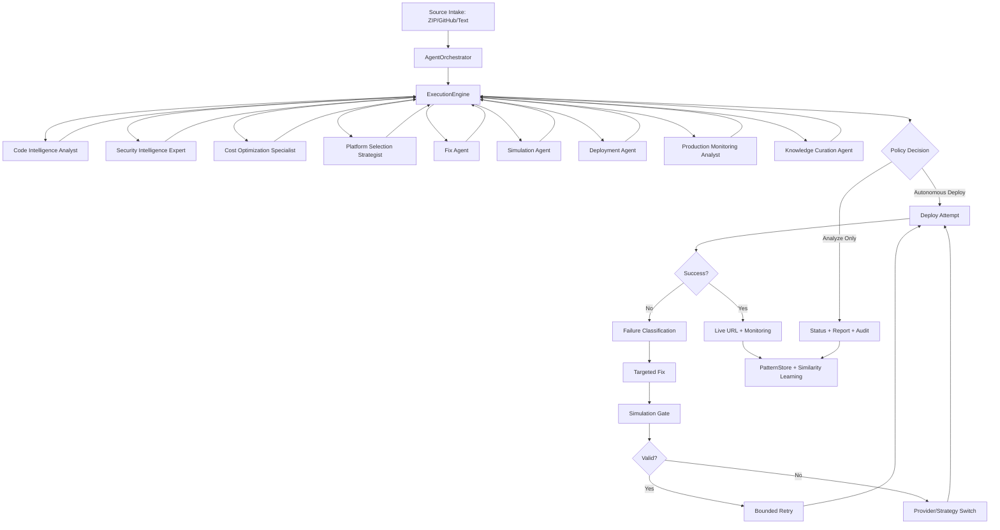

# Nestify - Updated Architecture, Agent Graph, and Feature Reference

Last updated: April 2026

Nestify is an agentic DevSecOps orchestration platform that performs source analysis, risk reasoning, bounded remediation, and cloud deployment with operator-visible decision traces.

This README is the canonical current-state product and architecture document.

## 1) System Goal

Nestify is built to solve four practical problems:

- opaque deployment failures,
- noisy low-signal logs,
- repeated manual remediation loops,
- weak traceability of autonomous decisions.

It does this through a deterministic execution engine with adaptive policy decisions and strict stop conditions.

## 2) Current LLM Policy (Updated)

Active path used by the platform is Groq + Gemini fallback routing in `app/services/llm_service.py`.

- Primary active providers:
  - Groq (`llama-3.1-8b-instant`, `llama-3.3-70b-versatile`)
  - Gemini (`gemini-2.0-flash`, `gemini-2.5-flash`)
- Controls:
  - per-model cooldown,
  - per-day token/request budgets,
  - automatic model fallback,
  - runtime disable for unavailable models.

Anthropic Sonnet is not part of the active runtime policy for this deployment baseline.

## 3) Updated Architecture Structure

### 3.1 Frontend

- Stack: React + Vite + TypeScript + Framer Motion
- Primary views:
  - Upload
  - Analysis
  - Deploy
  - Monitor
- Runtime behavior:
  - polling-first status synchronization,
  - structured one-line feed rendering,
  - progress and step-state UX contracts.

### 3.2 Backend

- Stack: FastAPI + async orchestration
- Core orchestrator entry:
  - `app/core/orchestrator.py`
- Deterministic execution source of truth:
  - `app/core/execution_engine.py`
- Project APIs:
  - `app/api/v1/projects.py`
  - `app/routes/upload.py`
  - `app/routes/status.py`

### 3.3 Data and Intelligence Layer

- Operational state: SQLite by default
- Graph intelligence: Neo4j + NetworkX
- Similarity memory: Qdrant vector store with in-memory fallback
- Learned patterns:
  - `PatternStore` + `SimilarityEngine`

## 4) Updated Agent Connectivity Graph

## 5) Execution Modes and Flow

### 5.1 Analyze Path

Purpose: build architecture, risk, and deployment intelligence without publishing a live deployment.

Core stages:

1. code analysis
2. security audit
3. learning/cost/platform reasoning
4. report + audit materialization

### 5.2 Autonomous Deploy Path

Purpose: perform deployment with bounded autonomous recovery.

Core stages:

1. deploy attempt
2. classify failure
3. apply fix
4. simulation validation
5. retry/switch strategy
6. live URL or explicit fallback outcome

### 5.3 Bounded Safety Policy

- max self-heal retries: 3
- anti-repeat action logic
- blocker escalation with explicit reason
- no infinite autonomous loops

## 6) Agent Skills and Responsibilities

### Meta-Agent / Decision Policy

- chooses next action from runtime state,
- enforces retry bounds,
- prevents repeated identical failure paths.

### Code Intelligence

- stack/runtime detection,
- architecture profiling,
- deployability context extraction.

### Security Intelligence

- vulnerability aggregation and enrichment,
- severity-based risk context for planning.

### Fix + Simulation

- deterministic remediation,
- simulation-gated patch acceptance before retry.

### Deployment Agent

- app-kind detection (`static`, `backend`, `docker`),
- provider routing,
- structured failure metadata,
- local fallback when credentials are missing.

### Monitoring + Learning

- runtime telemetry interpretation,
- persistent deployment outcome pattern memory,
- similarity-guided future recommendations.

## 7) Deployment Platform Policy and Why

Current routing policy in `DeploymentAgent`:

- static/spa/ssg -> Vercel
- backend/api/fullstack/docker -> Railway
- Netlify supported for static deployment alternatives
- local preview fallback when required cloud credentials are unavailable

Why:

- static-first platforms provide strong CDN/static UX,
- Railway aligns well with backend runtime hosting,
- fallback keeps the workflow non-blocking for users.

## 8) Updated Feature Inventory

### 8.1 Intake and Project Lifecycle

- ZIP/GitHub/Text ingestion
- project source persistence
- lifecycle status APIs
- readiness/progress contracts

### 8.2 Analysis and Intelligence

- code profile extraction
- security findings + grouped severity
- cost optimization matrix
- platform recommendation and debate support

### 8.3 Autonomous Recovery and Deployment

- failure classification (`missing_env`, `build_error`, `dependency_issue`, `infra_issue`, `unknown`)
- fix generation and simulation validation
- bounded retries and provider switching
- structured deploy response contract with next-action guidance

### 8.4 Frontend UX Contracts

- staged analysis progress
- structured one-line feed
- deploy step progress + completion bar
- changes-applied diff section
- final result card with URL/confidence/failure guidance

### 8.5 Reporting and Audit

- project report endpoint
- audit payload endpoint
- downloadable PDF report

### 8.6 Learning and Memory

- deployment pattern store
- vector similarity retrieval
- recommendation extraction from historical outcomes

## 9) Key APIs

- `POST /api/v1/projects/upload`
- `POST /api/v1/projects/github`
- `GET /api/v1/projects/{project_id}/status`
- `GET /api/status/{project_id}`
- `GET /api/v1/projects/{project_id}/autonomous-response`
- `POST /api/v1/projects/{project_id}/autonomous-fix-deploy`
- `GET /api/v1/projects/{project_id}/report`
- `GET /api/v1/projects/{project_id}/report/audit`
- `GET /api/v1/projects/{project_id}/report/pdf`

## 10) Tech Stack and Justification

Backend:

- FastAPI + Uvicorn: async orchestration and API throughput
- Pydantic: strict contract validation
- httpx: resilient provider/LLM HTTP integration

Frontend:

- React + Vite: fast iteration and modular UI composition
- Framer Motion: meaningful motion for state transitions
- Axios: stable API polling and request handling

Intelligence:

- Neo4j + NetworkX: architecture graph and dependency intelligence
- Qdrant (with fallback): scalable vector memory retrieval
- scikit-learn/numpy fallback path for embedding resilience

## 11) Security and Repo Hygiene

- do not commit `.env` or secrets
- do not commit runtime dumps, DB sidecars, or generated source snapshots
- do not commit virtual environment directories or build artifacts

## 12) Related Docs

- `README_ARCHITECTURE.md`
- `DEPLOYMENT_GUIDE.md`
- `docs/NESTIFY_ENGINEERING_JUSTIFICATION.md`
