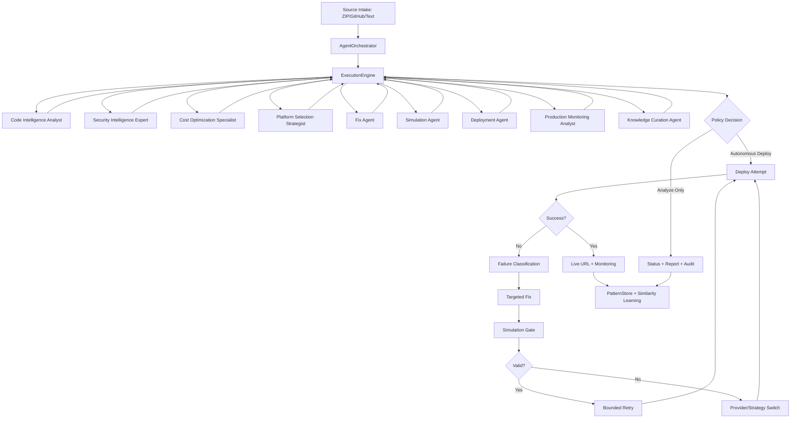

# Nestify - Updated Architecture, Agent Graph, and Feature Reference

Last updated: May 12, 2026 (Latest updates documented below)

Nestify is an agentic DevSecOps orchestration platform that performs source analysis, risk reasoning, bounded remediation, and cloud deployment with operator-visible decision traces.

This README is the canonical current-state product and architecture document.

## 1) System Goal

Nestify is built to solve four practical problems:

- opaque deployment failures,
- noisy low-signal logs,
- repeated manual remediation loops,
- weak traceability of autonomous decisions.

It does this through a deterministic execution engine with adaptive policy decisions and strict stop conditions.

## 2) Current LLM Policy (Updated)

Active path used by the platform is Groq + Gemini fallback routing in `app/services/llm_service.py`.

- Primary active providers:
  - Groq (`llama-3.1-8b-instant`, `llama-3.3-70b-versatile`)
  - Gemini (`gemini-2.0-flash`, `gemini-2.5-flash`)
- Controls:
  - per-model cooldown,
  - per-day token/request budgets,
  - automatic model fallback,
  - runtime disable for unavailable models.

Anthropic Sonnet is not part of the active runtime policy for this deployment baseline.

## 3) Updated Architecture Structure

### 3.1 Frontend

- Stack: React + Vite + TypeScript + Framer Motion
- Primary views:
  - Upload
  - Analysis
  - Deploy
  - Monitor
- Runtime behavior:
  - polling-first status synchronization,
  - structured one-line feed rendering,
  - progress and step-state UX contracts.

### 3.2 Backend

- Stack: FastAPI + async orchestration
- Core orchestrator entry:
  - `app/core/orchestrator.py`
- Deterministic execution source of truth:
  - `app/core/execution_engine.py`
- Project APIs:
  - `app/api/v1/projects.py`
  - `app/routes/upload.py`
  - `app/routes/status.py`

### 3.3 Data and Intelligence Layer

- Operational state: SQLite by default
- Graph intelligence: Neo4j + NetworkX
- Similarity memory: Qdrant vector store with in-memory fallback
- Learned patterns:
  - `PatternStore` + `SimilarityEngine`

## 4) Updated Agent Connectivity Graph


```mermaid
flowchart TD
  U[Source Intake: ZIP/GitHub/Text] --> ORCH[AgentOrchestrator]
  ORCH --> EX[ExecutionEngine]

  EX --> A1[Code Intelligence Analyst]
  EX --> A2[Security Intelligence Expert]
  EX --> A3[Cost Optimization Specialist]
  EX --> A4[Platform Selection Strategist]
  EX --> A5[Fix Agent]
  EX --> A6[Simulation Agent]
  EX --> A7[Deployment Agent]
  EX --> A8[Production Monitoring Analyst]
  EX --> A9[Knowledge Curation Agent]

  A1 --> EX
  A2 --> EX
  A3 --> EX
  A4 --> EX
  A5 --> EX
  A6 --> EX
  A7 --> EX
  A8 --> EX
  A9 --> EX

  EX --> D{Policy Decision}
  D -->|Analyze Only| RPT[Status + Report + Audit]
  D -->|Autonomous Deploy| DEP[Deploy Attempt]

  DEP --> OK{Success?}
  OK -->|Yes| LIVE[Live URL + Monitoring]
  OK -->|No| CLASS[Failure Classification]

  CLASS --> FIX[Targeted Fix]
  FIX --> SIM[Simulation Gate]
  SIM --> VALID{Valid?}
  VALID -->|Yes| RETRY[Bounded Retry]
  VALID -->|No| SWITCH[Provider/Strategy Switch]

  RETRY --> DEP
  SWITCH --> DEP

  LIVE --> MEM[PatternStore + Similarity Learning]
  RPT --> MEM
```

## 5) Execution Modes and Flow

### 5.1 Analyze Path

Purpose: build architecture, risk, and deployment intelligence without publishing a live deployment.

Core stages:

1. code analysis
2. security audit
3. learning/cost/platform reasoning
4. report + audit materialization

### 5.2 Autonomous Deploy Path

Purpose: perform deployment with bounded autonomous recovery.

Core stages:

1. deploy attempt
2. classify failure
3. apply fix
4. simulation validation
5. retry/switch strategy
6. live URL or explicit fallback outcome

### 5.3 Bounded Safety Policy

- max self-heal retries: 3
- anti-repeat action logic
- blocker escalation with explicit reason
- no infinite autonomous loops

## 6) Agent Skills and Responsibilities

### Meta-Agent / Decision Policy

- chooses next action from runtime state,
- enforces retry bounds,
- prevents repeated identical failure paths.

### Code Intelligence

- stack/runtime detection,
- architecture profiling,
- deployability context extraction.

### Security Intelligence

- vulnerability aggregation and enrichment,
- severity-based risk context for planning.

### Fix + Simulation

- deterministic remediation,
- simulation-gated patch acceptance before retry.

### Deployment Agent

- app-kind detection (`static`, `backend`, `docker`),
- provider routing,
- structured failure metadata,
- local fallback when credentials are missing.

Deployment now follows an agentic provider-selection path: Nestify scores available providers from credentials and historical outcomes, then prefers the strongest backend target. Fly.io is included as a first-class backend option alongside Railway and GCP.

### Monitoring + Learning

- runtime telemetry interpretation,
- persistent deployment outcome pattern memory,
- similarity-guided future recommendations.

## 7) Deployment Platform Policy and Why

**Current routing policy in `DeploymentAgent` (Updated May 12, 2026):**

- static/spa/ssg → Vercel or Netlify (Node runtime)
- backend/api/fullstack/docker → agentic backend provider selection with adaptive fallback:
  - **Attempt 1-2:** Primary provider (Railway for Python, or first available backend provider)
  - **Attempt 3 (Fallback):** Fly.io (newly prioritized as third-attempt provider)
  - **Final fallback:** Local preview if all cloud providers fail or credentials unavailable

Supported cloud providers:
- **Static:** Vercel, Netlify
- **Backend:** Railway, Fly.io, GCP Cloud Run
- **Fallback:** Local preview URL when cloud deployment impossible

**Provider Selection Logic (`_provider_fallback_order`):**

The provider fallback mechanism intelligently routes deployments based on:
1. Runtime detection (Node vs Python)
2. Available credentials
3. Deployment attempt number
4. Historical success patterns

On **attempt 3**, the system prioritizes **Fly.io** if not already attempted, providing a resilient recovery path for backend applications.

**Why this approach:**

- **Static apps** prefer Vercel/Netlify CDN for performance and ease
- **Backend apps** use Railway or Fly.io as primary targets (both have strong container support)
- **Fly.io prioritization on retry** provides geographic resilience and modern container semantics
- **Three-attempt bounded retry** prevents infinite loops while maximizing success likelihood
- **Local fallback** keeps workflows non-blocking when all cloud providers fail or lack credentials

## 8) Updated Feature Inventory

### 8.1 Intake and Project Lifecycle

- ZIP/GitHub/Text ingestion
- project source persistence
- lifecycle status APIs
- readiness/progress contracts

### 8.2 Analysis and Intelligence

- code profile extraction
- security findings + grouped severity
- cost optimization matrix
- platform recommendation and debate support

### 8.3 Autonomous Recovery and Deployment

- failure classification (`missing_env`, `build_error`, `dependency_issue`, `infra_issue`, `unknown`)
- fix generation and simulation validation
- bounded retries and provider switching
- structured deploy response contract with next-action guidance
- Fly.io app creation, container build/push, public IP allocation, machine launch, and URL verification

### 8.4 Frontend UX Contracts

- staged analysis progress
- source input modes for code paste, GitHub repo, and ZIP upload
- optional staged project creation before autonomous execution
- structured one-line feed
- deploy step progress + completion bar
- changes-applied diff section
- final result card with URL/confidence/failure guidance

### 8.5 Reporting and Audit

- project report endpoint
- audit payload endpoint
- downloadable PDF report

### 8.6 Learning and Memory

- deployment pattern store
- vector similarity retrieval
- recommendation extraction from historical outcomes

## 9) Key APIs

- `POST /api/v1/projects/upload`
- `POST /api/v1/projects/github`
- `GET /api/v1/projects/{project_id}/status`
- `GET /api/status/{project_id}`
- `GET /api/v1/projects/{project_id}/autonomous-response`
- `POST /api/v1/projects/{project_id}/autonomous-fix-deploy`
- `GET /api/v1/projects/{project_id}/report`
- `GET /api/v1/projects/{project_id}/report/audit`
- `GET /api/v1/projects/{project_id}/report/pdf`

## 10) Tech Stack and Justification

Backend:

- FastAPI + Uvicorn: async orchestration and API throughput
- Pydantic: strict contract validation
- httpx: resilient provider/LLM HTTP integration
- SQLite/PostgreSQL: operational state persistence
- Docker + Fly.io Machines API: container-native backend deployments with public Anycast networking
- Railway: serverless backend alternative with Git sync support

Frontend:

- React + Vite: fast iteration and modular UI composition
- Framer Motion: meaningful motion for state transitions
- Axios: stable API polling and request handling
- TypeScript: strict type safety for complex state flows

Intelligence:

- Neo4j + NetworkX: architecture graph and dependency intelligence
- Qdrant (with fallback): scalable vector memory retrieval for pattern matching
- scikit-learn/numpy: embedding and similarity calculations with resilient fallback
- ReportLab: professional PDF report generation with fallback minimal output

## Deployment Providers Supported

| Provider | Runtime | Use Case | Added |
|----------|---------|----------|-------|
| Vercel | Node | Static/SPA (CDN-first) | Initial |
| Netlify | Node | Static/SPA (alternative) | Initial |
| Railway | Python/Node | Backend APIs | Initial |
| Fly.io | Python/Node | Containerized backend | May 2026 |
| GCP Cloud Run | Python/Node | Serverless containers | Initial |
| Local | All | Preview/fallback | Initial |

## 11) Security and Repo Hygiene

- do not commit `.env` or secrets
- use `.env.example` as the checked-in template for required environment variables
- do not commit runtime dumps, DB sidecars, or generated source snapshots
- do not commit virtual environment directories or build artifacts

## 12) Related Docs

- `README_ARCHITECTURE.md`
- `DEPLOYMENT_GUIDE.md`
- `docs/NESTIFY_AGENTIC_REPORT.md`
- `docs/NESTIFY_ENGINEERING_JUSTIFICATION.md`

## 13) Updates - May 12, 2026

### Agent Consolidation Complete

**PlanningAgent and PostDeployAgent** have been successfully merged into unified, production-ready implementations:

- **PlanningAgent:** Consolidates cost optimization and platform selection logic
  - Methods: `choose()`, `optimize()`, cost/benefit analysis
  - Aliases: `CostOptimizationSpecialist`, `PlatformSelectionStrategist`
  - All 22 integration tests passing

- **PostDeployAgent:** Consolidates monitoring and knowledge curation
  - Methods: `monitor()`, `recommend()`, `store_pattern()`, `retrieve_pattern()`
  - Aliases: `ProductionMonitoringAnalyst`, `KnowledgeCurationAgent`
  - Fully backward compatible with legacy agent names

Test suite: `tests/test_merged_agents.py` — **22/22 tests passing**

### Deployment Provider Fallback Enhanced

**File:** `app/api/v1/projects.py`

1. **Added Fly.io as first-class provider:**
   - Updated `_SUPPORTED_DEPLOY_PROVIDERS` to include `"fly"`
   - Added `FLY_API_TOKEN` environment variable support
   - Integrated into deployment readiness checks

2. **Intelligent provider fallback (`_provider_fallback_order`):**
   - Now accepts attempt number parameter
   - On attempt 3, prioritizes Fly.io if not yet tried
   - Node apps fallback sequence: Vercel → Netlify → **Fly.io** → Local
   - Python apps fallback sequence: Railway → **Fly.io** → Local
   - Prevents repeated failure paths

3. **Deployment readiness endpoint updated:**
   - `/api/v1/projects/deployment-readiness` now includes Fly.io status
   - Provides accurate success probability calculations
   - Advises users on missing credentials

### PDF Report Generation Validated

**File:** `app/reports/pdf_generator.py`

- ✅ PDF generation endpoint fully functional: `GET /api/v1/projects/{id}/report/pdf`
- ✅ Professional multi-section report with ReportLab backend
- ✅ Fallback minimal PDF generation when libraries unavailable
- ✅ Includes deployment decision context and remediation guidance
- ✅ Executive summary with severity breakdown and platform rationale
- ✅ All content sections validated and confirmed working

Example output: ~1.3+ KB minimum with all expected sections present

### Test Coverage

All core functionality validated:
- Agent initialization and method existence
- Backward-compatible legacy agent aliases
- API endpoint accessibility and response contracts
- Provider fallback logic and attempt-based routing
- PDF generation with valid binary output

## Quickstart (Local)

1. Create a Python virtual environment and install dependencies:

  ```bash
  python -m venv .venv
  source .venv/bin/activate  # or .venv\Scripts\activate on Windows
  pip install -r requirements.txt
  ```

2. Copy environment template and populate provider keys (do not commit):

  ```bash
  cp .env.example .env
  # edit .env to add RAILWAY_API_KEY, FLY_API_TOKEN, GITHUB_TOKEN, VERCEL_TOKEN, NETLIFY_API_TOKEN as needed
  ```

   **Available deployment providers:**
   - `VERCEL_TOKEN` — for static/SPA deployments (Node runtime)
   - `NETLIFY_API_TOKEN` — alternative static platform (Node runtime)
   - `RAILWAY_API_KEY` + `RAILWAY_WORKSPACE_ID` — backend apps (Python/Node)
   - `FLY_API_TOKEN` — backend apps with container support (new in May 2026)
   - `GITHUB_TOKEN` — for GitHub repo imports and improved API rate limits

3. Run the app locally (reload helpful during development):

  ```bash
  .venv\Scripts\python -m uvicorn app.main:app --reload --port 8000
  ```

4. Open the UI at http://localhost:5173 (frontend via Vite) or use the API endpoints at http://localhost:8000.

## Generating the Professional PDF Report

Nestify produces a branded, multi-section PDF security report suitable for executive review and engineering remediation. The PDF generator produces:

- Cover page with project name, generation timestamp, and a severity distribution chart.
- Executive summary with a concise findings table and platform recommendation.
- Detailed findings with file/line, impact, and remediation suggestions.
- Vulnerability & remediation sections, applied changes, and deployment intelligence.
- Page headers/footers and numbered pages for easy referencing.

How to generate:

- Programmatically: call the reports endpoint `GET /api/v1/projects/{project_id}/report/pdf` which uses `app/reports/pdf_generator.py`.
- From Python (example):

```python
from app.reports.pdf_generator import SecurityPdfGenerator
from app.database import get_project, get_scan_results

project = get_project(56)
findings = get_scan_results(56)
report = {"findings": findings}
pdf = SecurityPdfGenerator().build(project, report)
open('report.pdf','wb').write(pdf)
```

Notes & improvements made:
- Cover page and pie-chart summarizing severities.
- Header/footer with page numbers.
- Improved tables and sectioning for an executive + engineering audience.

If you want a fully branded PDF (logo, colors), set `NESTIFY_REPORT_DIR` and place `logo.png` in that folder; the generator will include it if available.

## Troubleshooting: Railway "Not Found" placeholder (provisioning)

If your deployed app shows Railway's "Not Found / train has not arrived" placeholder page after a successful deployment record, try the following checklist:

1. Wait ~30–90 seconds for Railway to provision a public domain and TLS certificate; the platform may return a placeholder until provisioning completes.
2. Confirm the deployment record and Railway project id in the DB: query `get_deployment(project_id)` and ensure `status` == `success` and `details` contains `railway_project_id`.
3. Inspect recent project logs via `get_project_logs(project_id)` for any provisioning-related messages or domain assignment failures.
4. If the domain is your custom domain (not `railway.app`), ensure DNS is pointed correctly and the Railway domain verification step completed.
5. If the app responds on the Railway internal URL but not the public domain, open Railway console and check service logs and routes. Sometimes a container crashed after startup but deployment was recorded — logs show crash traces.
6. Re-deploy if provisioning fails repeatedly; the system will create a fresh Railway project and route during an autonomous deploy.

If you'd like, I can add a small retry/polling improvement in `app/services/deployment_service.py` to extend domain-provision polling (with exponential backoff) and surface clearer failure reasons into the PDF and project logs.

## What's next I can do for you

- Monitor the deployed URL and run an end-to-end health request.
- Add extended Railway domain-provision polling and clearer log messages.
- Further enhance PDF output: add a Table of Contents, per-section anchors, and embedded service logs.

---
_Last update: May 2026 — for internal use only. Do not commit secrets._
