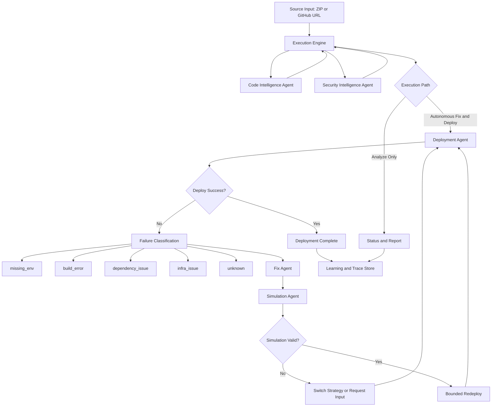
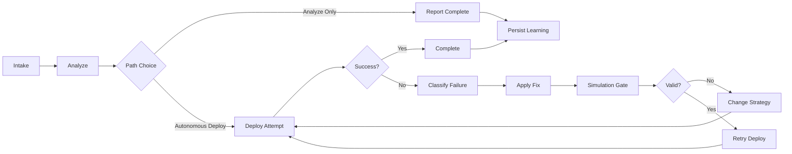

# Nestify Architecture and Feature Reference

Last updated: April 2026

This document is the canonical technical reference for Nestify architecture, pipeline behavior, agent graph, and feature coverage.

## 1) Product Definition

Nestify is an autonomous, decision-driven DevSecOps system that:

- ingests source code,
- analyzes architecture and risk,
- plans and applies bounded remediation,
- validates fixes through simulation,
- deploys with adaptive strategy,
- and surfaces high-signal operator feedback.

Nestify is designed as an orchestration system, not a static script pipeline.

## 2) Design Principles

- Decision over linear sequencing: next action is selected from current state.
- Safety over aggressive retries: fixes pass simulation gates before redeploy.
- Signal over verbose logs: UI prioritizes decisions, actions, outcomes.
- Bounded autonomy: no unbounded retry loops and no repeated fix spam.
- Explainability by default: trace, state, and rationale are persisted.

## 3) System Architecture Overview

### 3.1 Frontend

- Stack: React, Vite, TypeScript, Framer Motion.
- Primary pages:
  - Upload
  - Analysis
  - Deployment
- Realtime model:
  - WebSocket events for execution progress
  - polling fallback for status/report consistency
- UX model:
  - compressed live execution feed,
  - summary-first deployment view,
  - explicit fallback messaging.

### 3.2 Backend

- Stack: FastAPI.
- Orchestration core: app/core/execution_engine.py.
- API grouping: /api/v1/projects/* with project-centric workflow endpoints.
- Persistence: SQLite default for project state, findings, fixes, and deployment outcomes.

### 3.3 Intelligence and Agent Layer

Core actors:

- Meta-Agent / Orchestrator
- Code Intelligence Agent
- Security Intelligence Agent
- Fix Agent
- Simulation Agent
- Deployment Agent
- Knowledge Curation and Learning Layer

## 4) Agent Graph

## 5) End-to-End Pipeline

### 5.1 Analyze Path

1. Intake source and initialize project state.
2. Run architecture and stack profiling.
3. Enrich security and risk findings.
4. Build deployment/cost reasoning context.
5. Produce status and report artifacts.

Constraints:

- Analyze path does not auto-deploy.
- Analyze path does not run autonomous fix/deploy actions.

### 5.2 Autonomous Fix and Deploy Path

1. Start deployment attempt.
2. If failed, classify failure type.
3. Apply targeted remediation.
4. Run simulation validation gate.
5. If valid, retry deployment within bounded policy.
6. If invalid or exhausted, switch strategy/provider or request user input.
7. Mark success or explicit fallback outcome.

### 5.3 Pipeline Graph

## 6) Runtime State Contract

The execution context tracks policy-critical state:

- failures
- fixes_applied
- providers_tried
- provider_attempts
- last_failure_type
- simulation_validated
- decision_log

These fields are used for anti-repeat behavior, adaptive routing, and traceability.

## 7) Complete Feature Catalog

### 7.1 Source and Intake Features

- ZIP upload workflow.
- GitHub URL intake workflow.
- Project state initialization and status tracking.
- Temporary GitHub publishing support for ZIP-only backend deploy scenarios.

### 7.2 Analysis and Intelligence Features

- Stack/runtime/framework detection.
- Architecture profiling and dependency understanding.
- Security finding enrichment with risk-aware context.
- Deployment suitability reasoning.
- Cost and platform recommendation context generation.

### 7.3 Orchestration and Autonomy Features

- Decision-driven orchestration loop.
- Analyze-only and deploy paths separated by design.
- Failure-class-based action routing.
- Bounded retries with provider attempt caps.
- Duplicate-fix and repeated-strategy suppression.
- Strategy/provider switching on exhaustion conditions.
- Explicit user-input request paths for non-autonomous blockers.

### 7.4 Remediation and Validation Features

- Controlled fix execution.
- Simulation-gated retry policy.
- Deployment retry only after validation where applicable.
- Structured failure reason capture.

### 7.5 Deployment Features

- Cloud-first deployment routing.
- Provider-aware deployment logic.
- Explicit fallback semantics when cloud path cannot complete.
- Attempt-by-attempt deployment outcome tracking.
- Railway workspace-aware flow via RAILWAY_WORKSPACE_ID when required.

### 7.6 Frontend and Operator Experience Features

- Upload, Analysis, Deployment views.
- Realtime progress stream through WebSocket.
- Polling fallback for status/report consistency.
- Compressed high-signal execution feed:
  - decision/action/outcome emphasis,
  - duplicate event merge,
  - retry collapse,
  - reasoning-noise suppression.
- Summary-first deployment view with actionable controls.

### 7.7 Reporting and Audit Features

- Project status endpoint.
- Report endpoint.
- Audit report endpoint.
- PDF report export endpoint.

### 7.8 Learning and Historical Features

- Persistence of outcomes and traces.
- Reusable history for future routing and recommendation quality.
- Learning statistics support in API layer.

## 8) Feature Status Snapshot

### Implemented and Active

- Decision-driven orchestration core.
- Analyze/deploy path separation.
- Failure classification and adaptive action routing.
- Bounded retry policy with anti-repeat safeguards.
- Simulation-gated remediation loop.
- Compressed deployment feed UX.
- Core project/report/deploy API surface.

### Expanding

- Broader failure-class-specific remediation depth.
- Richer confidence modeling for simulation output.
- Additional scenario-based integration tests for routing behavior.

## 9) API Surface (High-Value)

- POST /api/v1/projects/upload
- POST /api/v1/projects/github
- GET /api/v1/projects/{project_id}/status
- GET /api/v1/projects/{project_id}/report
- GET /api/v1/projects/{project_id}/report/audit
- GET /api/v1/projects/{project_id}/report/pdf
- POST /api/v1/projects/{project_id}/autonomous-fix-deploy

## 10) Security and Repository Hygiene

Before publishing:

- Do not commit .env files or secrets.
- Do not commit local database files or sidecar variants.
- Do not commit runtime snapshots or generated project source dumps.
- Do not commit node_modules, dist, or virtual environment directories.
- Prefer private repository visibility for initial publication.

## 11) Operational Checklist

- Frontend build passes.
- Backend compile/syntax checks pass.
- Analyze flow and autonomous deploy flow both validated.
- Deployment feed remains concise and high-signal.
- No secret/runtime artifacts are staged in git.

## 12) Extension Guidance

When extending orchestration:

- add behavior through policy decisions, not hardcoded linear phase additions,
- keep actions idempotent and state-aware,
- emit feed-safe concise progress events.

When extending UI:

- preserve compressed execution feed contract,
- avoid reintroducing low-signal raw logs,
- keep deployment decisions and outcomes operator-readable.
