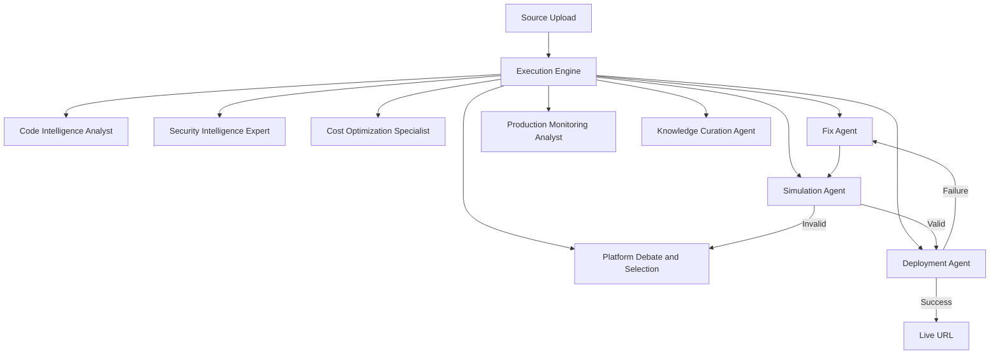

# Nestify Agentic System Report

Last updated: April 2026

## 1) Agent Graph and Workflow

Nestify uses a centralized execution core with specialized agents coordinated through a state-driven loop.

### 1.1 High-level graph



### 1.2 Runtime workflow (phase model)

1. Input and planning
2. Code analysis and security enrichment
3. Cost and platform planning
4. Fix generation and simulation validation
5. Deployment with bounded retries
6. Monitoring and learning persistence

### 1.3 Orchestration code references

Core execution step contract:

```python
class ExecutionStep(str, Enum):
    INPUT = "input"
    CODE_ANALYSIS = "code_analysis"
    SECURITY_AUDIT = "security_audit"
    AUTO_FIXES = "auto_fixes"
    DEPLOYMENT = "deployment"
    VERIFICATION = "verification"
    MONITORING = "monitoring"
    COMPLETED = "completed"
    FAILED = "failed"
```

Bounded autonomy:

```python
class ExecutionEngine:
    MAX_SELF_HEAL_RETRIES = 3
```

## 2) Skills and Tools Used by Agents (with code snippets)

### 2.1 Agent skills (specialized roles)

- CodeIntelligenceAnalyst
- SecurityIntelligenceExpert
- CostOptimizationSpecialist
- PlatformSelectionStrategist
- SelfHealingDeploymentEngineer
- ProductionMonitoringAnalyst
- KnowledgeCurationAgent

Coordinator wiring:

```python
self.code_agent = CodeIntelligenceAnalyst()
self.security_agent = SecurityIntelligenceExpert()
self.cost_agent = CostOptimizationSpecialist()
self.platform_agent = PlatformSelectionStrategist()
self.self_heal_agent = SelfHealingDeploymentEngineer()
self.monitor_agent = ProductionMonitoringAnalyst()
self.knowledge_agent = KnowledgeCurationAgent()
```

### 2.2 Agent tools

From app/agentic/tools:

- graph_query_tool.py
- pattern_matcher_tool.py
- metrics_collector_tool.py
- load_tester_tool.py
- docker_runner_tool.py
- docker_cost_tester.py
- cost_calculator_tool.py

### 2.3 Learning/memory tools used in workflow

Pattern memory and similarity retrieval:

```python
pattern_store = PatternStore()
similar = await pattern_store.find_similar_deployments(insights.code_profile, limit=10)
patterns = await pattern_store.extract_actionable_patterns(similar)
```

## 3) LLMs Used and Justification

### 3.1 Current LLM path in this runtime

Anthropic is disabled in current runtime path. Agentic calls route through shared fallback chain (Groq and Gemini) via app/services/llm_service.py.

Router behavior:

```python
fallback = await call_llm(messages, {**options, "task_weight": options.get("task_weight", "heavy")})
```

### 3.2 Model strategy and why

- Gemini and Groq are used through fallback routing to maximize resilience.
- Task-weight routing supports heavier reasoning when needed.
- Cooldown, token budget, and request budget handling in llm_service reduce outages and rate-limit failures.
- Multi-model fallback avoids single-vendor brittleness.

### 3.3 Why this is justified

- Reliability: requests continue even when one provider fails.
- Cost control: lightweight routes can use smaller models.
- Operational stability: budget and cooldown logic prevents burst failures.

## 4) Tech Stack Used and Justification

### 4.1 Backend

- FastAPI + Uvicorn
- Pydantic
- httpx
- python-dotenv

Justification:

- Async APIs and websockets for live progress streaming
- Strong request/response validation
- Provider integrations and robust HTTP handling

### 4.2 Frontend

- React + Vite
- Axios
- Framer Motion
- lucide-react

Justification:

- Fast UI iteration and performance
- Real-time polling/stream-friendly architecture
- Clear operator UX for analysis, deploy, monitor tabs

### 4.3 Data/Intelligence

- SQLite (default persistence)
- Neo4j + NetworkX (graph intelligence)
- Qdrant (vector memory with fallback)
- scikit-learn/numpy for embedding fallback and modeling

Justification:

- Practical local-first setup with scale-out options
- Graph + vector retrieval improves reasoning quality and historical reuse

## 5) Architecture Explanation

Nestify follows a layered architecture:

1. Interface layer: Upload, Analysis, Deployment, Monitor tabs
2. API layer: project-centric endpoints under /api/v1/projects
3. Orchestration layer: ExecutionEngine and AgenticCoordinator
4. Agent layer: specialized agents for analysis, security, fix, deploy, monitor
5. Intelligence layer: graph builder, pattern store, similarity engine
6. Persistence layer: project state, logs, deployment outcomes

### 5.1 Why this architecture works

- Clear separation of concerns keeps modules independently evolvable
- Centralized execution state prevents fragmented behavior
- Structured feed/audit/final output contracts keep UI consistent
- Bounded retry and simulation gate reduce unsafe deployment loops

### 5.2 User problem alignment

- Problem: noisy/unclear CI-CD operations
  - Solution: structured one-line feed + step-wise deploy state
- Problem: deployment uncertainty
  - Solution: provider-aware routing + failure classification + bounded retries
- Problem: repeated mistakes across projects
  - Solution: pattern memory and similarity-guided recommendations

## Appendix: Concrete Code References

- app/core/execution_engine.py
- app/agentic/coordinator.py
- app/agentic/llm_router.py
- app/services/llm_service.py
- app/agentic/tools/*
- app/learning/pattern_store.py
- app/learning/similarity_engine.py
